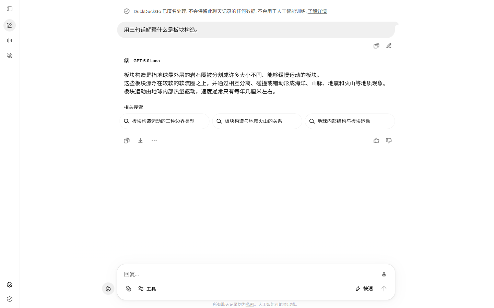

# free-web-ai-worker

**Let your AI coding agent outsource simple text subtasks to a free web AI.**

Your main agent keeps its context and tokens for the hard problems. The boring
text work -- summarising, translating, classifying, extracting, reformatting --
gets handed to a free web AI chat, and only the plain-text answer comes back.

```
main agent -> ask_web_ai(prompt) -> your own Edge/Chrome -> web AI -> plain text -> main agent continues
```

No API keys. No per-token billing. No extra browser download -- it drives the
Edge or Chrome you already have, reusing your own login through a dedicated,
isolated profile.

[](#installation)
[](LICENSE)
[](package.json)



---

## Why not just use the API?

Because most of your agent's work does not deserve a frontier model.

| | Main model handles it | This tool handles it |
|---|---|---|
| Cost per call | Real money, every token | Free (uses web UI access you already have) |
| Effect on context | Consumes the main agent's window | Zero -- only the final text crosses back |
| Good for | Reasoning, code, multi-step work | Summarise / translate / classify / extract |

**Keep the expensive model for the work that needs it.**

---

## How it differs from similar projects

There are existing tools that automate web AI chats. Here is the honest
comparison -- you should pick the one that fits your problem.

| | **free-web-ai-worker** | [Cavendish](https://github.com/ToaruPen/Cavendish) | [web-chat](https://github.com/ljie-PI/web-chat) | [PhantomAPI](https://github.com/mrshibly/PhantomAPI) |
|---|---|---|---|---|
| **Goal** | Outsource *subtasks* from an agent | Drive ChatGPT Pro from a CLI | Ask Gemini/ChatGPT from a skill | Expose ChatGPT as an OpenAI-compatible API |
| **Web AIs** | 5 (pluggable) | 1 (ChatGPT, hard-coded) | 2 (Gemini, ChatGPT) | 1 (ChatGPT) |
| **Provider abstraction** | Yes -- add a site in one file | No | No | No |
| **Interfaces** | CLI + MCP + Skill + Node module | CLI | Skill | HTTP API |
| **Anti-abuse guard** | Yes -- interval, cooldown, quota, breaker, cache | No | No | No |
| **Long jobs / attachments** | No | Yes | No | No |
| **License** | MIT | ISC | MIT | MIT |

**If you need** deep research, file attachments, or ChatGPT-Pro features -- use
Cavendish. **If you need** an OpenAI-compatible endpoint for n8n -- use
PhantomAPI. **If you want** an agent to hand off small text tasks to whichever
free web AI is available, without getting your account flagged -- that is this
project.

---

## Installation

Requires **Node.js >= 20** and **Microsoft Edge or Google Chrome**.

```bash
# Run straight from GitHub -- no install, no publish required
npx -y github:YOUR_GITHUB_USERNAME/free-web-ai-worker ask "Say OK" --json

# Or clone and run locally
git clone https://github.com/YOUR_GITHUB_USERNAME/free-web-ai-worker.git
cd free-web-ai-worker
npm install
node bin/ask-web-ai.js ask "Say OK" --json
```

> npm package name (`free-web-ai-worker`) is reserved and the publish metadata is
> ready, but the package is **not published yet**. Use the `npx github:` form
> above, or install from a clone.

### 60-second smoke test

```bash
node bin/ask-web-ai.js browser          # which browser will be used?
node bin/ask-web-ai.js providers        # list available web AIs
node bin/ask-web-ai.js ask "请用三句话解释什么是板块构造。" --json
```

The first run opens a **dedicated** Edge/Chrome window with its own profile
(`~/.agent-web-ai/profiles/<browser>`). Your everyday browser windows, history
and logins are never touched.

`duckai` and `qwen` need no account. Everything below that needs a login is a
one-time setup:

```bash
node bin/ask-web-ai.js login --provider deepseek   # sign in inside the window
node bin/ask-web-ai.js ask "test" -p deepseek --json
```

The session is stored in the dedicated profile and reused automatically.

---

## Use it from your agent

### 1. CLI (works with any agent that can run a shell)

```bash
ask-web-ai ask "<prompt>" --json                      # pure JSON on stdout
ask-web-ai ask --file ./subtask.txt --json            # avoid shell escaping
cat notes.md | ask-web-ai ask --stdin --json          # pipe long input
```

Logs always go to **stderr**, so `stdout` is safe to `JSON.parse` directly.

### 2. MCP (Cline, dsh, Claude Desktop, ...)

From a local clone (no publish required):

```json
{
  "mcpServers": {
    "free-web-ai-worker": {
      "command": "node",
      "args": ["<repo-root>/src/mcp-server.js"]
    }
  }
}
```

Exposes one tool: `ask_web_ai({ prompt, provider?, timeout_ms? })`.

### 3. Codex / agent skill

Copy `skills/free-web-ai-worker/` into your skills directory, or point your
agent at this repo. The skill uses the `npx github:` form so the folder works
standalone, without a local clone.

### 4. Node module

```js
import { askWebAI } from 'free-web-ai-worker';

const result = await askWebAI({ prompt: 'Summarise this in 3 sentences: ...', provider: 'duckai' });
if (result.status === 'success') console.log(result.answer);
```

---

## Supported web AIs

| Provider | Login | Status |
|---|---|---|
| `duckai` | not needed | **Verified** -- end-to-end, ~9-10s |
| `qwen` | not needed (guest mode) | **Verified** -- end-to-end, ~34s |
| `deepseek` | required | **Verified** -- end-to-end with a signed-in profile |
| `chatgpt` | required | Selectors only; not verified with a paid account |
| `grok` | required | Experimental -- selectors unverified |
| `gemini` | required | Experimental -- selectors unverified, ships disabled |

Adding a provider is one file: extend `WebAIProvider` in `src/providers/<id>.js`,
list it in `config/default.json`, register it in `src/providers/index.js`.
Timeouts, answer polling, error contracts, logging and failure capture are all
inherited.

Experimental providers ship **disabled**. To try one:

```json
// config/local.json
{ "providers": { "gemini": { "enabled": true } } }
```

---

## Anti-abuse guard

This tool talks to sites through your own logged-in browser. That is a
privilege, and the guard exists to keep it from looking like abuse.

| Layer | Default | What it does |
|---|---|---|
| Minimum interval | **20s** (+0-8s jitter) | Two calls to the same provider never fire back to back |
| Cooldown | every **8** calls -> **3 min** | Breaks up long batches |
| Daily quota | **40** calls/provider | Rolling 24h ceiling |
| Circuit breaker | **30 min** | Trips automatically on a captcha or access block |
| Answer cache | 1h | Identical prompts never reach the site twice |

Polling while waiting for an answer is also deliberately **slower and
irregular** (1.2x-2.4x the base interval) to reduce request volume.

This is demand reduction, not detection evasion. The tool never solves
CAPTCHAs, never forges logins, and never tries to defeat a rate limit. When a
site asks for a human, it hands the job to you.

```bash
ask-web-ai limits      # today's usage vs the caps
ask-web-ai cache       # cache status; --clear to empty it
```

For genuinely large batches, use the provider's official API instead -- this
tool is built for occasional delegation, not throughput.

---

## Result contract

Success:

```json
{
  "status": "success",
  "provider": "duckai",
  "answer": "Plate tectonics describes ...",
  "meta": { "url": "https://duck.ai/", "chars": 95, "elapsedMs": 9276, "cached": false }
}
```

Failure -- always structured, always includes a stable `code`:

```json
{
  "status": "error",
  "provider": "deepseek",
  "error": "DeepSeek is not signed in. ...",
  "code": "login_required",
  "details": { "url": "https://chat.deepseek.com/sign_in" },
  "meta": { "artifacts": "~/.agent-web-ai/profiles/edge/artifacts/..." }
}
```

| Code | Meaning | What to do |
|---|---|---|
| `invalid_input` | empty prompt or bad option | fix the call |
| `unknown_provider` | provider id not recognised | run `providers` |
| `provider_disabled` | disabled in config | enable in `config/local.json` |
| `login_required` | site is signed out | run `login --provider <id>` once |
| `captcha_required` | human verification on screen | solve it in the visible window, then retry |
| `access_blocked` | site is rate-limiting this network | wait, or use another provider |
| `selectors_stale` | page layout changed | check the artifact screenshot; a selector needs updating |
| `timeout` | no stable answer in time | raise `--timeout`, check artifacts |
| `browser_unavailable` | browser/CDP would not start | run `browser`; first launch is slow |
| `rate_limited_locally` | the guard refused the call | wait or switch provider; never loop-retry |
| `extraction_failed` | answer appeared but text was empty | check the screenshot |
| `internal_error` | anything else | check stderr logs |

---

## Commands

```bash
ask-web-ai ask "<prompt>"                 # ask (JSON by default when piped)
ask-web-ai ask "<prompt>" --text          # human-readable output
ask-web-ai ask "<prompt>" --no-cache      # bypass the answer cache
ask-web-ai login --provider deepseek      # one-time login in the dedicated profile
ask-web-ai browser                        # which browser is used / installed
ask-web-ai browser --use chrome           # switch browser
ask-web-ai browser --stop                 # close the window this tool opened
ask-web-ai providers                      # list providers and login requirements
ask-web-ai limits                         # usage vs the anti-abuse caps
ask-web-ai cache [--clear]                # inspect / clear the answer cache
ask-web-ai status                         # browser + profile + defaults
```

---

## Troubleshooting

Every failure leaves evidence:

```
~/.agent-web-ai/profiles/<browser>/artifacts/<timestamp>-<provider>/
  screenshot.png    what the page looked like at the moment of failure
  page.html         full HTML, for updating selectors
  summary.json      page text, URL, error code, capture time
```

The path is returned in `meta.artifacts`. Useful flags:

```bash
ask-web-ai ask "x" -p duckai --log-level debug   # per-selector detail
ask-web-ai ask "x" -p duckai --dry-run           # validate config, no browser
ask-web-ai ask "x" -p duckai --timeout 300       # longer answer budget
```

Common situations:

- **`login_required`** -- run the login command once; the profile remembers it.
- **`captcha_required`** -- complete the challenge yourself in the visible
  window. The tool will not and cannot do it for you.
- **`access_blocked`** -- the site decided your network looks suspicious. Wait,
  or switch provider. This is never bypassed.
- **`selectors_stale`** -- the site changed its DOM. Open the artifact
  screenshot, update the provider's selector list, and re-run.

---

## Configuration

Defaults live in `config/default.json`. Per-machine overrides go in
`config/local.json` (git-ignored):

```bash
cp config/local.json.example config/local.json
```

Key settings: `browser.preferred` (`edge` or `chrome`), `defaults.provider`,
`defaults.timeoutMs`, `throttle.*`, `cache.*`, `providers.<id>.enabled`.

Environment overrides: `AWA_PROVIDER`, `AWA_TIMEOUT_MS`, `AWA_BROWSER_PORT`,
`AWA_CHROME_PATH`, `AWA_PROFILE_DIR`, `AWA_LOG_LEVEL`.

---

## Design principles

1. **Never bypass a gate.** No CAPTCHA solving, no forged logins, no rate-limit
   evasion, no stealth/anti-detection tricks. Human steps stay human.
2. **Use your own browser and your own access.** A dedicated profile over CDP,
   fully isolated from your everyday browsing.
3. **Two things cross the boundary:** the prompt, and the structured result.
4. **Failures are diagnosable.** Stable error codes plus screenshot and HTML.
5. **No over-engineering.** No database, no daemon, no queue.

---

## Known limitations

- **Selectors break when sites redesign.** Mitigated by multi-selector fallbacks,
  failure artifacts, and the `selectors_stale` code -- not eliminated.
- **Visible browser by default.** Headless mode triggers bot checks on several
  sites, so the tool drives a real window.
- **The guard makes batch work slow** on purpose (40/day, 20s apart). For real
  volume, use an official API.
- **Not verified:** ChatGPT needs a paid account; Grok and Gemini are
  experimental.
- **Concurrency:** each call opens a tab; the profile is shared. Keep it to 2-3.
- **Answers are not guaranteed.** Web AIs hallucinate. Verify anything critical.

---

## Roadmap

- Task Router: automatic routing between the main model and web AIs
- Result cache improvements and batch API
- Provider health checks and a selector `doctor`
- More providers (Kimi, Z.ai, Copilot)

---

## Project layout

```
bin/ask-web-ai.js          CLI entry
src/index.js               public API (askWebAI)
src/core/ask.js            single entry point; returns structured results, never throws
src/core/browser.js        Edge/Chrome detection, launch, CDP reuse, switching
src/core/provider.js       provider base: timeouts, polling, keyboard input, extraction
src/core/throttle.js       anti-abuse guard: interval, cooldown, quota, breaker
src/core/cache.js          answer cache
src/core/artifacts.js      failure forensics: screenshot, HTML, summary
src/providers/*.js         per-site adapters (pluggable)
src/mcp-server.js          dependency-free MCP stdio server
skills/free-web-ai-worker/ agent skill definition
scripts/probe-*.mjs        development-time selector probes
tests/                     offline unit tests + live e2e
```

---

## Credits and prior art

Built by studying -- but not copying -- several excellent projects:

| Project | License | What we took |
|---|---|---|
| [ToaruPen/Cavendish](https://github.com/ToaruPen/Cavendish) | ISC | The CDP + persistent-profile architecture; ChatGPT selector baseline |
| [ljie-PI/web-chat](https://github.com/ljie-PI/web-chat) | MIT | Reusing an already-running browser; answer stability polling |
| [mrshibly/PhantomAPI](https://github.com/mrshibly/PhantomAPI) | MIT | Response-waiting strategy reference |
| [STAR-173/LLMSession-Docker](https://github.com/STAR-173/LLMSession-Docker) | MIT | Evaluated and not adopted (headless container triggers bot checks) |

Only runtime dependency: [`playwright-core`](https://github.com/microsoft/playwright) (Apache-2.0),
which drives the browser you already have instead of downloading another one.

## License

MIT -- see [LICENSE](LICENSE).
